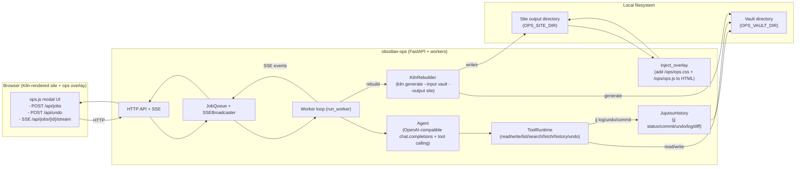

# Deep research report on obsidian-ops and the Kiln static site generator

## Executive summary

The repository is a **local-first “ops overlay”**: it serves a Kiln-generated static website of an Obsidian vault and injects a floating UI panel that lets a user describe edits (“clean this note up”, “add a summary”, “create a new note”, etc.). Those instructions are executed by an LLM agent with a constrained toolset (read/write/list/search/fetch URL/history/undo), then the vault is versioned via **Jujutsu (jj)**, the site is **rebuilt with Kiln**, and the overlay streams progress back to the browser via **Server-Sent Events (SSE)**. citeturn22view0turn15view0turn17view0turn8view0turn7view6turn12view0

Key architectural attributes:

- **Two coupled artifacts**: (a) a Markdown vault under `OPS_VAULT_DIR`, and (b) a static site output directory under `OPS_SITE_DIR` produced by `kiln generate`. The output is **post-processed** to inject `/ops/ops.css` and `/ops/ops.js` into every HTML page. citeturn7view5turn7view6turn7view4  
- **LLM boundary**: the agent calls an OpenAI-compatible chat-completions endpoint (default points to a local vLLM-style base URL) and can only act through explicitly defined tools. citeturn7view5turn15view0turn17view0  
- **Change safety mechanisms**: atomic writes, per-file asyncio locks, vault path validation (anti-traversal and “protected directories”), and the ability to undo the most recent change via `jj undo`. citeturn13view7turn13view10turn13view6turn13view2turn8view0  

Project status is “fresh and active”: the commit history shows multiple commits on **April 5, 2026**, with the initial commit on **April 4, 2026**. There are **0 open issues and 0 open pull requests** at the time of inspection, and **no releases** published. citeturn23view0turn22view0  

## Repository overview

### Purpose and target users

The project describes itself as a “Local-first operations overlay for an Obsidian vault” and “an interactive web interface for a local Obsidian vault, built on Kiln.” citeturn22view0turn23view1

From the code and demo workflow, the target user is best characterized as:

- Someone maintaining an Obsidian-style vault locally who wants **in-browser, guided/automated edits** without giving up local file ownership, and who is comfortable running local services like **Kiln**, **Jujutsu**, and an OpenAI-compatible inference backend (often vLLM). citeturn18view0turn14view4turn9view0turn7view5  

### Main features

The implemented feature set is centered around one end-to-end loop:

- Serve a static site generated from a vault (via Kiln), and inject an overlay UI into each HTML page. citeturn7view6turn7view4turn22view0  
- Let the user submit an instruction from the browser; the client posts to `/api/jobs` and listens on `/api/jobs/{jobId}/stream` for SSE events of types like `status`, `tool`, `error`, `done`. citeturn12view0turn12view1  
- Execute the instruction via an agent loop that calls an OpenAI-compatible chat endpoint with tool-calling enabled (`tools=...`, `tool_choice="auto"`), then run the requested file operations in the vault. citeturn15view0turn16view3turn17view0  
- If files were changed: commit via Jujutsu (`jj commit -m ...`), rebuild the static site via `kiln generate --input <vault> --output <site>`, then reinject the overlay. citeturn8view0turn13view2turn7view6turn7view4  
- Provide an explicit “Undo” button in the overlay: it posts to `/api/undo`, triggers `jj undo`, rebuilds, and warns if rebuild fails. citeturn12view0turn8view0turn13view2turn7view6  

## Architecture and code structure

### Repository layout and primary languages

GitHub’s language breakdown shows the repo is primarily **Python**, with smaller portions of **JavaScript**, **CSS**, and **Nix**. citeturn22view0turn23view1

The top-level structure includes:

- `src/obsidian_ops/` (core server + agent + tooling)  
- `demo/obsidian-ops/` (a demo vault and demo run flow)  
- `tests/`  
- `devenv.nix` and `devenv.yaml` (development environment configuration, including a pinned Kiln input)  
- `pyproject.toml` (package manifest) citeturn22view0turn9view1turn23view1  

### Core frameworks and runtime requirements

From `pyproject.toml`, the project requires:

- **Python ≥ 3.13** (`requires-python = ">=3.13"`) citeturn23view1  
- Runtime Python dependencies: `fastapi`, `uvicorn`, `openai`, `httpx`, `pydantic`, `pydantic-settings`, `typer`. citeturn23view1turn15view0turn16view3  
- External binaries expected at runtime (configurable): `jj` and `kiln`. citeturn7view5turn13view2turn7view6  

The included `devenv.nix` config indicates a Nix/devenv-oriented setup that provisions `git`, `jujutsu`, `uv`, and a Kiln package sourced from a pinned flake input, plus Python 3.13 with a venv and uv support. citeturn9view0turn9view1  

### Configuration model and process entrypoints

Configuration is a `pydantic-settings` `BaseSettings` model with `env_prefix="OPS_"`, making environment variables the primary runtime configuration mechanism. Key fields include:

- `OPS_VAULT_DIR`, `OPS_SITE_DIR` (required paths)  
- `OPS_VLLM_BASE_URL`, `OPS_VLLM_MODEL`, `OPS_VLLM_API_KEY` (OpenAI-compatible backend)  
- `OPS_JJ_BIN`, `OPS_KILN_BIN`, `OPS_KILN_TIMEOUT_S`  
- `OPS_MAX_TOOL_ITERATIONS`, `OPS_MAX_SEARCH_RESULTS`, `OPS_PAGE_URL_PREFIX`  
- `OPS_HOST`, `OPS_PORT` citeturn7view5  

The module entrypoint runs Uvicorn against `obsidian_ops.app:app` using the configured host/port. citeturn6view8turn7view5  

## Core components, workflows, and Kiln integration

### System data flow and component interactions

The system is best understood as an evented pipeline:

1) **Static site generation**: vault → `kiln generate` → site output directory  
2) **Overlay injection**: post-process the generated HTML to insert references to `/ops/ops.css` and `/ops/ops.js`  
3) **User instruction**: browser overlay posts a job request; server enqueues it  
4) **Agent execution**: LLM tool-calls drive controlled filesystem edits in the vault  
5) **Versioning + rebuild**: commit via jj, regenerate site, reinject overlay  
6) **Progress streaming**: SSE messages update the UI as each phase completes citeturn7view6turn7view4turn12view0turn8view0turn15view0turn13view2  

A concise architecture diagram follows. (This is derived directly from the client/server code paths and the rebuild/injection wrappers.) citeturn12view0turn8view0turn15view0turn7view6turn7view4turn13view2  



### The overlay UI and API expectations

The front-end overlay is intentionally minimal and framework-free:

- It creates a floating action button and a modal with an instruction textarea, “Run”, “Refresh”, and “Undo”. citeturn11view0  
- Submitting a job performs `fetch("/api/jobs", { method: "POST", body: { instruction, current_url_path } })`, then opens `EventSource("/api/jobs/${jobId}/stream")` and subscribes to event types `status`, `tool`, `result`, `error`, `done`. citeturn12view0turn12view1  
- Undo submits `POST /api/undo` and then streams the same way. citeturn12view0  

This design implies the server is responsible for:

- Mapping `current_url_path` (a site URL path) back to a vault markdown file path; the repo provides `resolve_page_path(...)` which tries candidates like `"{path}.md"` and `"{path}/index.md"` (and `index.md` for root). citeturn7view8turn12view0  

### Agent design and tool-calling boundary

The agent loop is a classic “tool-augmented chat” design:

- It constructs a system prompt that (a) describes the assistant’s role and rules (preserve YAML frontmatter, preserve wikilinks, no deletion unless clearly intended, prefer minimal edits), and (b) optionally states the “currently viewing” file path. citeturn15view0  
- It calls an OpenAI-compatible chat completions API via `openai.AsyncOpenAI(...).chat.completions.create(...)` with:
  - `model = OPS_VLLM_MODEL`  
  - `base_url = OPS_VLLM_BASE_URL`  
  - `tools = get_tool_definitions()`  
  - `tool_choice = "auto"` citeturn15view0turn7view5turn17view0  
- It iterates up to `OPS_MAX_TOOL_ITERATIONS` times; on each tool call it parses JSON arguments, logs a progress event, executes the tool, and appends a `"role": "tool"` response. citeturn15view0turn7view5  
- The returned job result is always a dict with at least `summary` and `changed_files` (from the ToolRuntime’s tracked write set). citeturn15view0turn16view1  

### ToolRuntime: concrete capabilities and data handling

The tool surface area is narrowly defined (and explicitly declared as JSON schema tool definitions), which is a meaningful safety and predictability boundary:

- `read_file(path)` reads a vault-relative path after validation. citeturn16view0turn17view0turn13view6  
- `write_file(path, content)` validates + locks per file + writes atomically, then tracks the relative path in `changed_files`. citeturn16view0turn13view10turn13view7  
- `list_files(glob_pattern="**/*.md")` enumerates vault files (default markdown-only). citeturn16view1turn17view0  
- `search_files(query, glob_pattern="**/*.md")` performs a naive substring scan, returning compact contextual snippets, capped by `OPS_MAX_SEARCH_RESULTS`. citeturn16view2turn7view5  
- `fetch_url(url)` fetches arbitrary URLs via `httpx.AsyncClient`, truncating to `FETCH_URL_LIMIT_BYTES = 120 * 1024`. citeturn16view3turn16view0  
- `undo_last_change()` delegates to `jj undo`. citeturn16view3turn13view2  
- `get_file_history(path, limit)` delegates to `jj log ...`, returning a list of log lines. citeturn16view3turn13view2  

Vault path validation is explicitly defensive:

- It rejects `..` path segments (“Path traversal is not allowed”). citeturn13view6  
- It rejects writes to “protected directories” (via `PROTECTED_DIRS`, not enumerated in the extracted snippet). citeturn13view6  
- It resolves the candidate path and checks it is within the vault root (“Path is outside the vault”). citeturn13view6  

### The job worker: operational lifecycle and failure modes

The worker function is the orchestrator, coordinating agent execution, versioning, and rebakes:

- It records and broadcasts status messages like “Job started”, “Recording changes…”, “Rebuilding site…”. citeturn8view0  
- Undo jobs call `jj.undo()`, then attempt rebuild and injection; if rebuild fails, the job still succeeds but returns a warning that content may be stale. citeturn8view0turn7view6  
- Non-undo jobs:
  - Execute `agent.run(...)`  
  - If `changed_files` is non-empty: commit with message `ops: {instruction[:80]}` and then rebuild and inject. citeturn8view0turn13view2turn15view0turn7view6turn7view4  
  - If JJ commit fails after modifications, the worker raises an error indicating files were changed but history recording failed. citeturn8view0  
- The worker always terminates a job stream by sending a `done` event (even on error). citeturn8view0turn12view0  

### How Kiln is used: concrete “APIs”, patterns, and data flows

In this system, Kiln is used primarily as a **CLI API**, not a linked library:

- The wrapper `KilnRebuilder` runs:  
  `kiln generate --input <vault_dir> --output <site_dir>` with a configurable `kiln_bin` and a timeout (`OPS_KILN_TIMEOUT_S`, default 180s). citeturn7view6turn7view5  
- Kiln’s documentation confirms the semantics of `generate`: it converts an Obsidian vault into a static site and supports `--input` and `--output` flags with defaults `./vault` and `./public`. citeturn21view0turn20view0  
- Kiln’s docs also state that “The output directory is cleaned automatically before each build,” which makes the repo’s repeated post-build injection step necessary: injection must run after every generate because prior injected files may be removed/overwritten. citeturn21view0turn8view0turn7view4  

Kiln feature alignment (relevant to this repo’s operating assumptions):

- Kiln positions itself as “zero-config” and distributed as a single binary, oriented toward Obsidian parity (wikilinks, callouts, canvas, mermaid, math). citeturn20view0turn21view0  
- Kiln outputs a site with client-side navigational behavior (docs attribute “Instant Navigation” to HTMX) and other interactive elements; this motivates serving the site through an HTTP server rather than opening files directly. citeturn20view0turn21view3  

### Component mapping: repo vs Kiln capabilities

| obsidian-ops component | What it does | Kiln feature it relies on / complements |
|---|---|---|
| `KilnRebuilder` (`kiln generate --input/--output`) citeturn7view6 | Rebuilds site output from the vault | `generate` command + flags `--input`, `--output` and its “clean output directory” behavior citeturn21view0 |
| `inject_overlay` (HTML post-processing) citeturn7view4 | Adds `<link>` + `<script>` tags pointing to `/ops/ops.css` and `/ops/ops.js` | Complements Kiln’s static output by extending every page after generation (no Kiln-native hook shown in repo) citeturn21view0turn7view4 |
| `page_context.resolve_page_path` citeturn7view8 | Maps a site URL path to a plausible `.md` file in the vault | Aligns with Kiln’s default URL style (`note/index.html` vs `note.html` via `--flat-urls`) and “clean URL” expectations citeturn21view0turn21view3 |
| Static site serving inside obsidian-ops (implementation referenced by overlay + commits) citeturn12view0turn23view0 | Hosts the generated site and the `/ops/*` assets so browser features work | Kiln docs emphasize HTTP serving for interactive functionality; Kiln also offers `serve` for local preview (repo chooses to integrate serving instead) citeturn21view3 |
| Potential extension: Custom Mode (`--mode custom`) | Not currently used by repo | Kiln supports Custom Mode, templates, and `env.json` environment constants citeturn21view0turn21view1 |

## Installation, configuration, and usage

### Dependencies and environment variables

From `pyproject.toml`, installing the Python package provides `ops-demo` as a console script entrypoint for running the demo workflow. citeturn23view1

From `Settings`, the key environment variables are:

- Required:
  - `OPS_VAULT_DIR` (must exist and be a directory)  
  - `OPS_SITE_DIR` (will be created if missing) citeturn7view5  
- Strongly implied operational dependencies (executables on PATH unless overridden):
  - `OPS_JJ_BIN` (default `jj`)  
  - `OPS_KILN_BIN` (default `kiln`) citeturn7view5turn13view2turn7view6  
- LLM backend:
  - `OPS_VLLM_BASE_URL` default `http://127.0.0.1:8000/v1`  
  - `OPS_VLLM_MODEL` default `local-model`  
  - `OPS_VLLM_API_KEY` default empty string citeturn7view5turn15view0  

### Running the server

The server can be started either through the module entrypoint (which runs Uvicorn) or directly via Uvicorn:

```bash
# Option A: module entrypoint (uses OPS_HOST/OPS_PORT)
python -m obsidian_ops

# Option B: uvicorn directly (as used by the demo CLI)
uvicorn obsidian_ops.app:app --host 127.0.0.1 --port 8080
```

The existence of the module entrypoint and the Uvicorn import path are explicit. citeturn6view8turn14view0turn23view1  

### Demo workflow (recommended for validation)

The demo is documented as a “realistic Obsidian-style vault and a one-command local run flow”:

- It clones `demo/obsidian-ops/vault` into an isolated runtime vault, initializes it into a Jujutsu workspace (`jj git init`), sets `OPS_VAULT_DIR` and `OPS_SITE_DIR`, runs an initial Kiln build + injection on startup, and uses a vLLM backend default of `http://remora-server:8000/v1`, auto-selecting a model from `GET /v1/models` unless set explicitly. citeturn18view0turn14view4turn14view1  

Representative commands (as documented):

```bash
devenv shell -- uv sync --extra dev
devenv shell -- ops-demo run
# then open http://127.0.0.1:8080/
```

citeturn18view0turn9view0turn23view1  

The alternate shell entrypoint `demo/obsidian-ops/run_demo.sh` forwards `HOST`, `PORT`, `VLLM_BASE_URL`, `VLLM_MODEL`, `VLLM_API_KEY` into an `ops-demo run ...` invocation. citeturn19view0turn14view0  

### Kiln installation context

Kiln describes itself as a single binary with “zero dependencies” and provides installation methods (Go-based install and direct downloads) and verification guidance such as checksums and `kiln version`. citeturn20view0turn21view2  

In this repository specifically, the dev environment pins Kiln via a Nix flake input referencing `github:otaleghani/kiln/v0.9.5`. citeturn9view1turn9view0  

## Security, limitations, known issues, and maintenance status

### Security posture

Observed protections and helpful constraints:

- **Tool boundary**: the agent can only operate via enumerated tools (read/write/list/search/fetch URL/history/undo). This substantially reduces the action surface compared to a general-purpose shell tool. citeturn17view0turn15view0  
- **Filesystem safety**:
  - Atomic write strategy using a temp file + `os.replace`, reducing partial-write corruption risk. citeturn13view7  
  - Per-file asyncio locks to prevent concurrent writes to the same file. citeturn13view10turn16view0  
  - Vault path validation preventing traversal and enforcing “inside vault” semantics. citeturn13view6turn16view0  
- **Revert capability**: undo uses `jj undo`. citeturn13view2turn16view3  

Material security gaps (or at least “not evidenced” in reviewed artifacts):

- **No authentication/authorization is evident at the client boundary**: the overlay posts to `/api/jobs` and `/api/undo` without any token, session, or signature mechanism. This suggests the server endpoints are intended for trusted/local use and should not be exposed publicly as-is. citeturn12view0turn22view0  
- **SSRF-style risk via `fetch_url`**: the tool allows arbitrary URL fetches from the server side (albeit with size truncation). In a strictly local deployment this is less concerning; if exposed beyond localhost, it becomes a meaningful risk. citeturn16view3turn16view0  

### Reliability limitations and operational edge cases

- **Rebuild failure handling**: if site rebuild fails after changes are committed, the system warns that refresh may show stale content (i.e., vault is updated but site output is not). This is handled explicitly in the worker. citeturn8view0turn7view6  
- **History recording failure after edits**: the workflow treats inability to commit as a serious error (“Files were changed but history recording failed…”), which could leave the vault modified but without the expected jj commit boundary. citeturn8view0turn13view2  
- **Search scalability**: `search_files` performs a linear scan of vault files and lines, capped only by `OPS_MAX_SEARCH_RESULTS`. Large vaults may see latency. citeturn16view2turn7view5  
- **Full rebuild per job**: the system runs `kiln generate` on each validated change set; there’s no incremental-build integration shown. (Kiln itself documents a “Dev Command” for watch/rebuild/serve workflows and also lists “Incremental Builds” as a feature area, but this repo uses `generate` directly.) citeturn21view0turn7view6turn8view0  

### Known issues, issues/PRs, release posture, and activity

- Repository metadata indicates **0 stars**, **0 forks**, **no releases published**, and **24 commits**. citeturn22view0  
- The commit log shows multiple commits on **April 5, 2026** (including test/docs/refactor/fix/feat commits) and an **initial commit on April 4, 2026**, implying very recent creation and active iteration. citeturn23view0  
- GitHub navigation shows **Issues 0** and **Pull requests 0** at the time of inspection. citeturn22view0turn23view0  

## Recommended improvements and potential extensions

### Hardening and operational safety

Add a clear “trusted local deployment” boundary, and enforce it in code:

- Bind to localhost by default is already present (`host="127.0.0.1"`), but add explicit warnings/logging if binding to non-loopback. citeturn7view5  
- Introduce authentication (even a simple shared-secret header) for `/api/*` endpoints; the current browser client uses no auth, so this would require coordinated changes in `ops.js`. citeturn12view0turn11view0  
- Constrain `fetch_url` with an allowlist (or disable it by default) to reduce SSRF exposure when the server is reachable by other devices. citeturn16view3  

### Workflow and UX improvements

- Expose a **“preview/diff”** tool before committing (the jj wrapper already supports `diff_for_file`, but it is not exposed as a tool in `get_tool_definitions`). This would enable a review step in the UI (human-in-the-loop) and improve trust. citeturn13view2turn17view0  
- Provide a “commit message / change summary” preview and/or include the job ID in commit metadata. Current commit is `ops: {instruction[:80]}`; richer formatting could aid auditability. citeturn8view0turn13view2  
- Add a multi-step undo history (today it appears to map to `jj undo`, which is “most recent change” oriented). If the intent is “undo last ops job,” clarify by using jj bookmarks/tags per job or ensuring each job corresponds to a single commit boundary. citeturn8view0turn13view2  

### Kiln-specific integration opportunities

Kiln offers several knobs that this repo could optionally surface:

- Pass through selected `kiln generate` flags (`--name`, `--url`, theme/font/layout, `--flat-urls`, disabling TOC/local graph/backlinks). These are documented by Kiln and could be mapped to `OPS_*` env vars or a small config file, making site output more predictable across environments. citeturn21view0turn7view5turn7view6  
- Consider using Kiln’s `dev` command (build + watch + serve) for development workflows; today the repo runs `generate` per job and appears to integrate serving itself. citeturn21view0turn7view6turn23view0  
- If long-term direction includes templated “custom mode” sites, Kiln supports Custom Mode and an `env.json` pattern for site-wide constants; obsidian-ops could generate or manage `env.json` as part of deployment workflows. citeturn21view0turn21view1turn20view0  

## Important files and prioritized sources

### Important files table

| Path | What it contains | Why it matters |
|---|---|---|
| `README.md` | High-level project description (“local-first operations overlay… built on Kiln”). citeturn22view0 | Establishes intent and scope; primary orientation. |
| `pyproject.toml` | Package metadata, Python requirement (≥3.13), dependencies, and `ops-demo` script entrypoint. citeturn23view1 | Canonical runtime/build manifest. |
| `devenv.nix` | Dev environment packages: git, jujutsu, uv, kiln; Python 3.13 and venv. citeturn9view0 | “Reference environment” for reproducible setup. |
| `devenv.yaml` | Pins Kiln to `github:otaleghani/kiln/v0.9.5`. citeturn9view1 | Clarifies expected Kiln version in the repo’s dev workflow. |
| `src/obsidian_ops/__main__.py` | Uvicorn launcher for `obsidian_ops.app:app`. citeturn6view8 | Main module entrypoint. |
| `src/obsidian_ops/config.py` | `Settings` (`OPS_` env vars), tool iteration limits, binaries, timeouts. citeturn7view5 | Single source of truth for runtime configuration. |
| `src/obsidian_ops/agent.py` | LLM agent loop using `openai.AsyncOpenAI` + tool calling + iteration cap + progress events. citeturn15view0 | Core “automation brain.” |
| `src/obsidian_ops/tools.py` | ToolRuntime implementations and tool JSON schemas for function calling. citeturn16view2turn17view0 | Defines the safety boundary and capabilities. |
| `src/obsidian_ops/queue.py` | JobQueue, SSEBroadcaster, and `run_worker` orchestration of undo/commit/rebuild/inject. citeturn8view0 | Defines end-to-end operational lifecycle and failure handling. |
| `src/obsidian_ops/history_jj.py` | `jj` wrapper: `status`, `commit`, `undo`, `log`, `diff`. citeturn13view2 | Provides durable history and undo capabilities. |
| `src/obsidian_ops/rebuild.py` | Runs `kiln generate --input/--output` with timeout. citeturn7view6 | The sole Kiln integration point (CLI “API”). |
| `src/obsidian_ops/inject.py` | `inject_overlay` inserts `/ops/ops.css` + `/ops/ops.js` into generated HTML. citeturn7view4 | Bridges static output and interactive ops overlay. |
| `src/obsidian_ops/page_context.py` | `resolve_page_path` maps URL paths to vault `.md` files. citeturn7view8 | Enables “current page → current note” context. |
| `src/obsidian_ops/fs_atomic.py` | Atomic writes + vault path validation (anti traversal / protected dirs). citeturn13view7turn13view6 | Safety and integrity for all write operations. |
| `src/obsidian_ops/locks.py` | Per-file asyncio lock manager. citeturn13view10 | Prevents concurrent write clobbering. |
| `src/obsidian_ops/models.py` | Pydantic models for jobs, SSE events, request/response payloads. citeturn13view8 | Shared API/data contracts across server logic. |
| `src/obsidian_ops/static/ops.js` | Overlay UI: submit job + undo + SSE streaming. citeturn12view0 | Defines browser-side protocol and UX. |
| `src/obsidian_ops/static/ops.css` | Overlay styling rules. citeturn12view5 | Presentation only, but required for usability. |
| `demo/obsidian-ops/README.md` | One-command demo plan; explains jj init + OPS_* vars + Kiln build + vLLM defaults. citeturn19view1 | Best “how to run” documentation in repo. |
| `src/obsidian_ops/demo_cli.py` | Demo CLI (Typer); validates vLLM by querying `/v1/models`, sets OPS_* env vars, runs Uvicorn. citeturn14view4turn14view0 | Reference operational script for real deployments. |
| `demo/obsidian-ops/run_demo.sh` | Shell wrapper exposing `HOST/PORT/VLLM_*` overrides → `ops-demo run`. citeturn19view0 | Convenience entrypoint, documents env override shape. |

### Prioritized sources used

Primary sources (most authoritative for this report):

- Repository landing page (scope, structure, language mix). citeturn22view0  
- `pyproject.toml` (dependencies, Python version requirement, scripts). citeturn23view1  
- Core runtime code: agent/tooling/queue/rebuild/inject/history/path validation/UI JS. citeturn15view0turn17view0turn8view0turn7view6turn7view4turn13view2turn13view6turn12view0  
- Commit history (recency and maintenance status). citeturn23view0  

Primary Kiln documentation sources (for CLI semantics and feature mapping):

- Kiln project overview and positioning. citeturn20view0  
- Kiln `generate` command documentation (flags, output behavior, what gets generated). citeturn21view0  
- Kiln installation documentation (single-binary distribution, verification, version check). citeturn21view2  
- Kiln `serve` command documentation (why HTTP serving is required; clean URL handling). citeturn21view3  
- Kiln custom-mode `env.json` environment constants (potential extension point). citeturn21view1