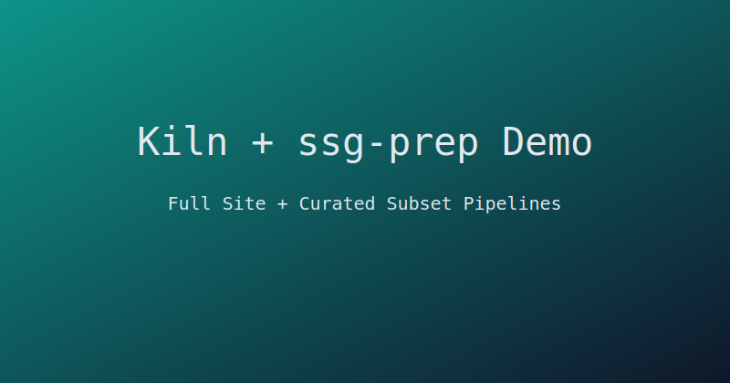
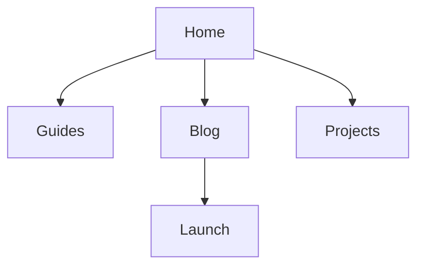

# Kiln + ssg-prep Demo

This vault is a complete demo for Kiln rendering plus `ssg-prep` subset publishing.

## Start Here

- Read [[getting-started]]
- Explore rendering features in [[rendering-features|Rendering Features Guide]]
- Visit the launch write-up: [[2026-03-01-launch-log]]
- Read the project story: [[client-alpha-case-study#outcome]]
- Open the concept map: [[site-map|Site Map Canvas]]

> [!tip]
> Use this vault to build one full site and two prep-driven subsets.

## Embedded Content

![[reusable-cta]]

## Math + Mermaid

Inline math: $E=mc^2$.

See [[404]] for custom error page content.
